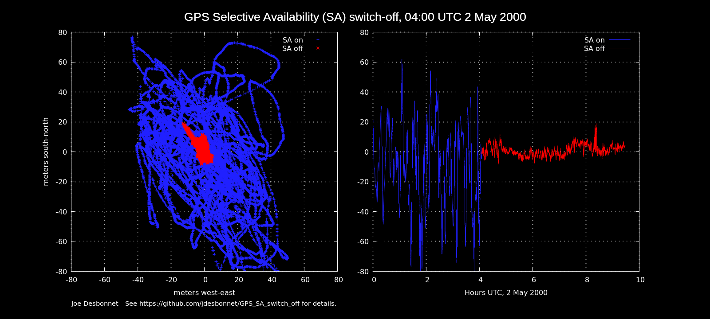

# GPS Selective Availability (SA) switch off

This captures the moment SA was switched off at about 2000-05-02T04:05:00Z

Selective Availability was the mechanism by which the US military (the 'owners' of the US GPS system)
provided limited access to civilian applications during its formative years. The SA system degraged
spacial resolution to about +/- 100m whereas the system was capabable of +/- 10m to military GPS receivers. 
A incident where the Soviet Union shot down Korean Air Lines Flight 007 in September 1983 due to 
a nagivation error was one of the catalysts for its removal. 

I caught this with a Garmin GPS-35 receiver in Dublin on 2 May 2000. The 
switch event and approximate time was announced in advance so I thought it would make an interesting
before and after comparison. I left the receiver run all night while logging
output (in Garmin Binary mode for some extra signal meta-data). I had rendered a quick gnuplot of the 
event back when it happened, and wrote a shot blog post about it 
in 2011.

I thought I had lost this file, but in some pre-Christmas cleaning I came upon
an old CD ROM marked 'GPS stuff'. 

If you use this data please credit "Joe Desbonnet"

Related links:

* Data From the First Week Without Selective Availability https://www.gps.gov/systems/gps/modernization/sa/data/
* Statement by the President regarding the United States' decision to stop degrading Global Positioning System accuracy https://clintonwhitehouse3.archives.gov/WH/EOP/OSTP/html/0053_2.html
